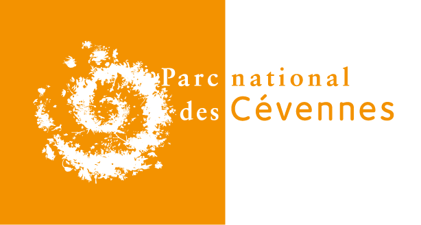

projet_pnc
==========

A Symfony project created on March 10, 2015, 4:08 pm.

#Projet d'application de saisie des protocoles naturalistes

Le projet se décline en deux bundles :

*PNC/BaseAppBundle* qui est une base généraliste ayant pour vocation d'être réutilisée par chaque application

*PNC/ChiroBundle* la mise en application de cette base pour fournir une interface de saisie des protocoles de suivi des chiroptères.

Auteurs
-------

Parc national des Cévennes

* Frédéric FIDON
* Amandine SAHL

License
-------

* OpenSource - GPL V3
* Copyleft 2015 - Parc national des Cévennes

